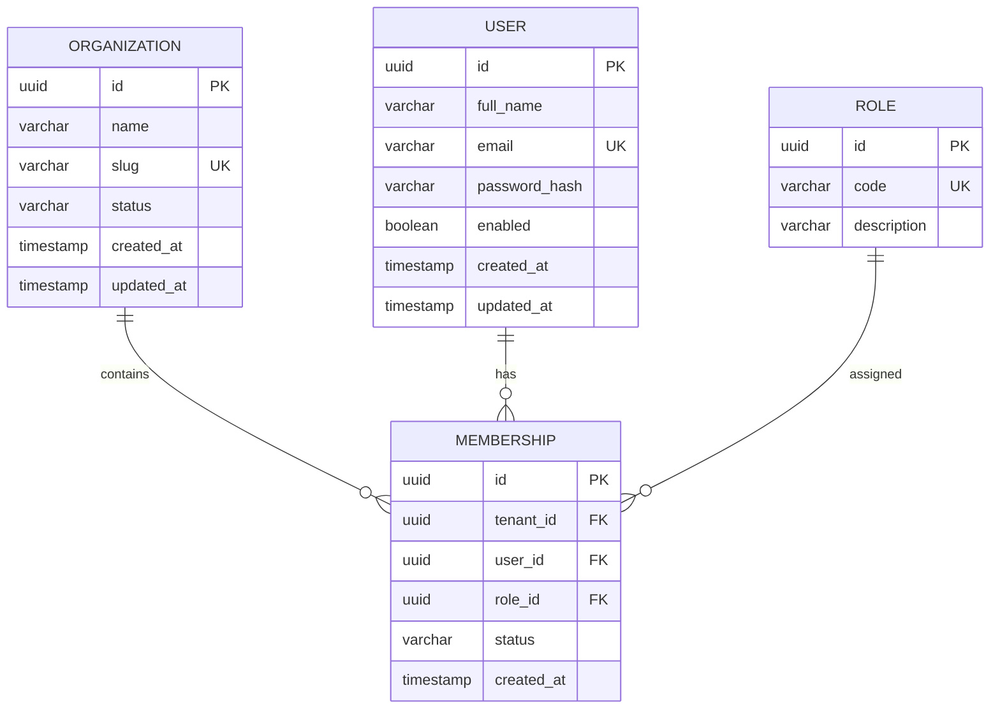

# FlowOps AI — Identity Service Database Design

**Version:** 1.0
**Status:** Proposed Day 1 implementation
**Owner:** Identity Service

## 1. Purpose

The Identity Service manages organizations, users,
roles and memberships.

It owns its PostgreSQL database. Other services must
not access its tables directly.

## 2. Entity Relationship Diagram

## 3. Organization

Represents a tenant company.

Fields:
- id: UUID, primary key
- name: VARCHAR(150), required
- slug: VARCHAR(100), unique, required
- status: VARCHAR(20), required
- created_at: TIMESTAMPTZ, required
- updated_at: TIMESTAMPTZ, required

Initial status: ACTIVE.

The organization ID is the tenant identifier.

## 4. User

Represents a registered platform user.

Fields:
- id: UUID, primary key
- full_name: VARCHAR(150), required
- email: VARCHAR(254), unique, required
- password_hash: VARCHAR(255), required
- enabled: BOOLEAN, required
- created_at: TIMESTAMPTZ, required
- updated_at: TIMESTAMPTZ, required

Email addresses must be normalized before storage.

Passwords must never be stored in plaintext.

## 5. Role

Defines organization-level authorization roles.

Fields:
- id: UUID, primary key
- code: VARCHAR(30), unique, required
- description: VARCHAR(255)

Initial roles:
- ORG_ADMIN
- MANAGER
- EMPLOYEE

Role records are seeded through Flyway.

## 6. Membership

Associates a user with an organization and a role.

Fields:
- id: UUID, primary key
- tenant_id: UUID, required
- user_id: UUID, required
- role_id: UUID, required
- status: VARCHAR(20), required
- created_at: TIMESTAMPTZ, required

Foreign keys:
- tenant_id references organization(id)
- user_id references users(id)
- role_id references role(id)

Constraints:
- UNIQUE(tenant_id, user_id)
- Index on tenant_id
- Index on user_id

Each membership has one role in the initial MVP.

## 7. Registration Transaction

Company registration must be atomic.

Within one database transaction:

1. Validate the registration request.
2. Check normalized email and organization slug.
3. Generate organization and user UUIDs.
4. Securely hash the administrator password.
5. Insert the organization.
6. Insert the administrator user.
7. Create the ORG_ADMIN membership.
8. Commit the transaction.

If any operation fails, roll back the transaction.

Database uniqueness constraints remain authoritative
when concurrent registration requests occur.

## 8. Tenant Isolation

The authenticated JWT identifies the active tenant.

Membership must be validated before issuing a
tenant-scoped JWT.

Client-supplied tenant IDs must never override the
authenticated tenant identity.

Tenant-scoped queries must include tenant_id.

Cross-tenant access must be rejected and tested.

## 9. Design Decisions

- Use UUID primary keys.
- Use service-owned PostgreSQL databases.
- Use Flyway for schema migrations.
- Use a membership model for organization access.
- Start with one role per membership.
- Enforce tenant-aware repository queries.
- Use database constraints to prevent duplicates.

## 10. Implementation Status

Architecture: Proposed.
Flyway migrations: Pending.
JPA entities: Pending.
Repositories: Pending.
Registration API: Pending.
Integration tests: Pending.